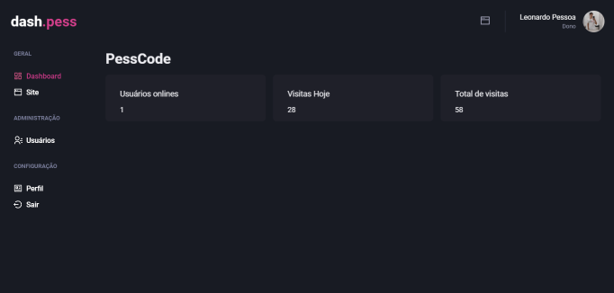

<h1 align="center">
  <a>
    Dash.pess
  </a>
</h1>

<b>Dash.pess</b> foi desenvolvido com HTML, SASS, JAVASCRIPT e PHP, um dashboard com o princípio de fazer edições em sites, ter uma interface moderna e acessível! Muito fácil de fazer adaptações, edições e adições de novas features.

   

  

  

  

  

  

Um projeto onde eu realmente busquei a perfeição na interface e acessibilidade! Ultilizando também um pouco de conhecimento em PHP e MYSQL com a estrutura MVC, mesmo não tendo estudado PHP tão a fundo fiquei contente com o resultado e pelo fato de não ter encontrado tantas dificuldades no desenvolvimento me mostrou que minha base está bem bacana e agora posso continuar a estudar nextJS XD

